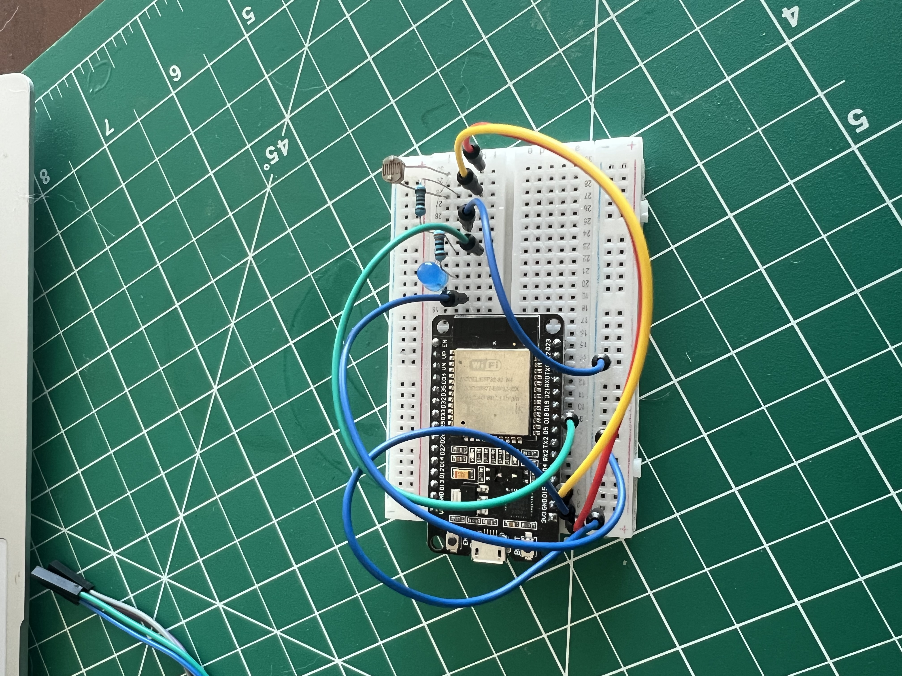
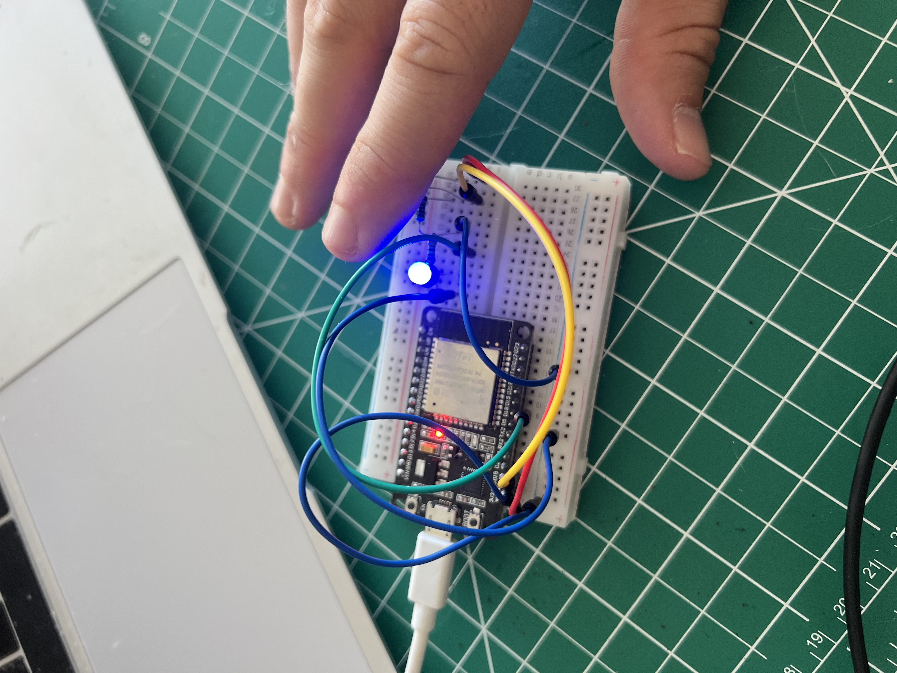

This project is something I made as a light sensor for future projects.

This is the main board design

This is when the board is on. So the light sensor has deteced light lower then the threashhold.
